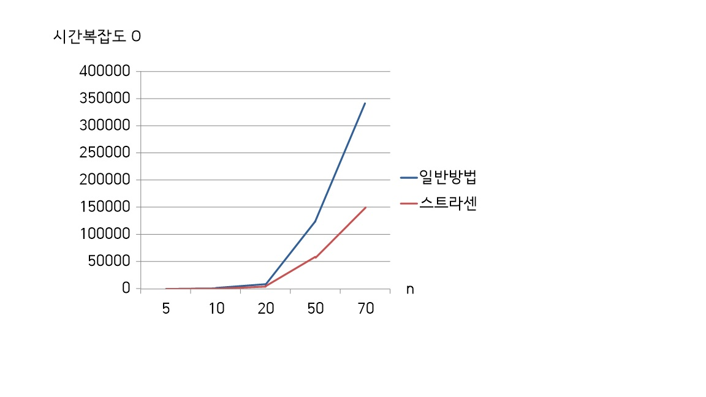

<h1>스트라센 알고리즘
</h1>

<h2>일반적인 행렬의 곱</h2>

* n x n 행렬 과 n x n 행렬을 곱하면 O(nnn) 가 되어 결과적으로 O(n^3) 의 시간 복잡도를 가진다.

<h2>스트라센 알고리즘이란</h2>

- 독일의 수학자 스트라센이 만들었고, 일반적인 행렬의 곱의 시간복잡도가 더 낮은 O(n^2.807)을 가진다.

- A와 B를 정사각행렬이라고 하면, 두 행렬의 곱 C는 다음과 같다.
$$
  AXB=C
  $$
  

  만약 A와 B가 2ⁿ × 2ⁿ 꼴의 크기가 아니라면 먼저 모자라는 행과 열을 0으로 채운다. 이 경우 행렬 곱셈이 끝난 뒤 행렬에서 필요한 부분만 다시 잘라 내야 한다.
  이제 A, B, C를 같은 크기의 정사각행렬 네 개로 나눈다.
$$
A = \begin{bmatrix} A_1,_1 & A_1,_2 \\ A_2,_1 & A_2,_2 \end{bmatrix}
$$

$$
B= \begin{bmatrix} B_1,_1 & B_1,_2 \\ B_2,_1 & B_2,_2 \end{bmatrix}
$$

$$
C = \begin{bmatrix} C_1,_1 & C_1,_2 \\ C_2,_1 & C_2,_2 \end{bmatrix}
$$

  따라서 다음이 성립한다.

$$
C_1,_1 = A_1,_1B_1,_1 + A_1,_2B_2,1
$$

$$
C_1,_2 = A_1,_1B_1,_2 + A_1,_2B_2,2
$$

$$
C_2,_1 = A_2,_1B_1,_1 + A_2,_2B_2,1
$$

$$
C_2,_2 = A_2,_1B_1,_2 + A_2,_2B_2,2
$$

  이 과정에서는 필요한 연산의 수가 줄어 들지 않는다. 여전히 C*i, j* 행렬을 계산하려면 여덟 번의 곱셈과 네 번의 덧셈이 필요하다.
  이제 다음과 같은 행렬을 정의한다.
$$
M1 = (A_1,_1 + A_2,_2)(B_1,_1 + B_2,_2)
$$

$$
M2 = (A_2,_1 + A_2,_2)B_1,_1
$$

$$
M3 = A_1,_1(B_1,_2-B_2,_2)
$$

$$
M4 = A_2,_2(B_2,_1-B_1,_1)
$$

$$
M5 = (A_1,_1+A_1,_2)B_2,_2
$$

$$
M6 = (A_2,_1 - A_1,_1)(B_1,_1 + B_1,_2)
$$

$$
M7=(A_1,_2 - A_2,_2)(B_2,_1 + B_2,_2)
$$

   이 행렬들을 계산하는 데는 일곱 번의 곱셈(각 변수마다 한 번씩)과 10번의 덧셈이 필요하다. 이제 Ci,j 행렬은 다음과 같이 표현할 수 있다.

$$
C_1,_1 = M1 + M4-M5+M7
$$

$$
C_1,_2 = M3+M5
$$

$$
C_2,_1 = M2+M4
$$

$$
C_2,_2 = M1-M2=M3=M6
$$

  이 과정에서는 곱셈이 사용되지 않기 때문에, 전체 곱셈을 일곱 번의 곱셈과 18번의 덧셈으로 처리할 수 있다. 큰 행렬에 대해서는 행렬의 곱셈이 덧셈보다 더 많은 시간을 필요로 하기 때문에 덧셈을 더 하는 대신 곱셈을 덜 하는 것이 전체적으로 더 효율적이다.
  이 과정을 재귀적으로 반복할 경우 총
$$
7*n^{log_27}-6*n^2
$$
의 연산이 필요하게 된다.
$$
log_27 = 2.807...
$$
이어서 전체 수행 시간은
$$
O(n^{2.807})
$$
이다.

<h2>일반적인 방법과 스트라센 알고리즘의 수행시간 비교</h2>

위의 그래프는 일반적인 행렬 곱셈 방법과 스트라센 알고리즘의 시간복잡도 비교를 위해 직접 만들어 본 그림이다.

그래프를 보면 n의값이 작을때는 일반적인 방법과 스트라센 알고리즘의 시간복잡도는 거의 비슷하지만 n이 커지면 커질수록 그 차이는 훨씬 많이 난다.