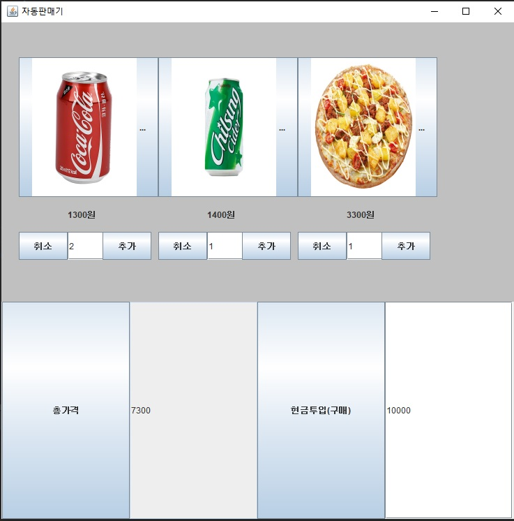
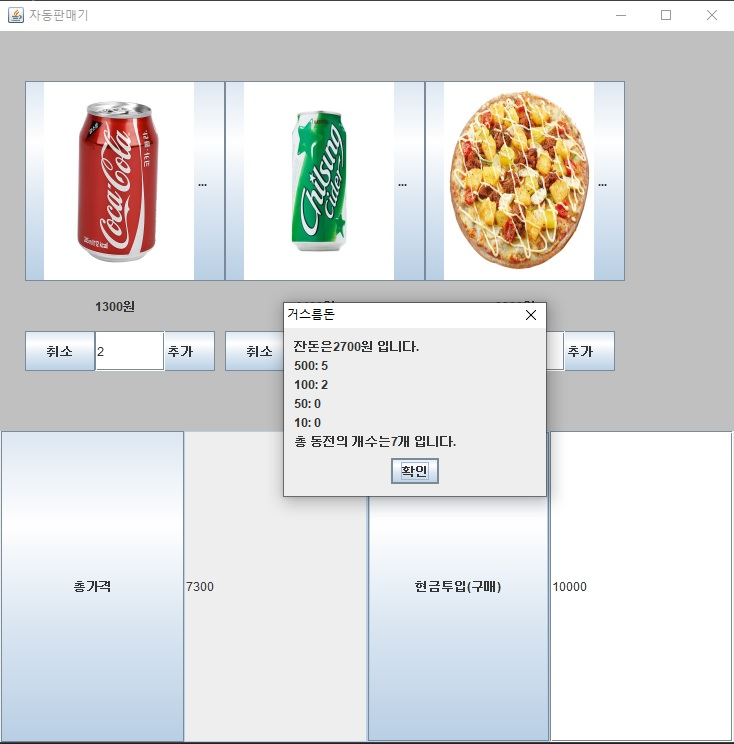

<h1>자판기 만들기 과제</h1>

이번 과제는 java swing을 이용하여 자동판매기 프로그램을 만들어 보는 것이었습니다.  밑의 내용은 그에 대한 설명과 결과 화면입니다.


<h2>팀원 이름</h2>

201601702 박재권

201601719 음영현

201901670 문규리


<h2>코드 설명</h2>

```java
import java.awt.*;
import java.awt.event.*;
import javax.swing.*;

public class VendingMachine {
    public static void main(String[] args) {
        FF ff = new FF();
    }
}
```

맨 처음은 메인 함수가 있는 VendingMachine 클래스 입니다. 이 코드 밑에 FF라는 클래스를 만들었는데, 그 클래스에 대한 객체 생성을 한 것입니다.


```java
class FF extends JFrame {
    FF() {
        this.setTitle("자동판매기");
        this.setBounds(0, 0, 750, 750);
        this.setVisible(true);
        this.setDefaultCloseOperation(JFrame.EXIT_ON_CLOSE);

        // jp1=North쪽 패널
        Panel jp1 = new Panel();
        jp1.setLayout((LayoutManager)null);
        jp1.setSize(0, 400);
        jp1.setBackground(Color.LIGHT_GRAY);

        //콜라1300원 사이다1400원 피자3300원
        int[] price = new int[]{1300, 1400, 3300};
        String[] menu = new String[]{"콜라", "사이다", "피자"};

        //버튼들이랑 텍스트 생성
        JButton[] jb = new JButton[3];
        JButton[] plus = new JButton[3];
        JButton[] minus = new JButton[3];
        JTextField[] ncount = new JTextField[3];
        JLabel[] jl = new JLabel[3];
```

FF라는 클래스를 만들었는데, 이 때 JFrame 클래스를 상속받았습니다. 그럼 이 FF클래스 객체가 생성되는 동시에 생성자가 호출되어 프레임이 만들어집니다. JFrame은 레이아웃 기본 속성이 BorderLayout이기 때문에 jp1이라는 패널을 만들어 North구역에 넣어줄 것입니다.

jp1의 레이아웃을 null로 해준 이유는 생성한 버튼들과 텍스트들을 자동으로 정렬하기에 어려움이 있어서 절대적으로 좌표를 지정해주어서 깔끔하게 만들기 위함입니다.

* 컴포넌트 설명
  * jb:음식사진을 넣기 위한 버튼
  * plus,minus:선택한 음식 갯수 추가,취소
  * ncount:선택한 음식 갯수
  * jl:가격 표시


```java
// 버튼들 위치 설정 jb버튼에 음식 이미지 삽입
        //nunber는 선택한 음식 수량 //plus는 갯수 추가 //minus는 갯수 취소
        //jl에 음식들 가격 적어놓음
        for(int i = 0; i < 3; ++i) {
            jb[i] = new JButton(menu[i]);
            jb[i].setBounds(25 + i * 200, 50, 200, 200);
            ncount[i] = new JTextField("0");
            ncount[i].setEditable(true);
            ncount[i].setBounds(jb[i].getX() + 70, jb[i].getY() + 250, 70, 40);
            plus[i] = new JButton("추가");
            plus[i].setBounds(jb[i].getX() + 120, ncount[i].getY(), 70, 40);
            plus[i].setEnabled(true);
            minus[i] = new JButton("취소");
            minus[i].setBounds(jb[i].getX(), ncount[i].getY(), 70, 40);
            minus[i].setEnabled(true);
            jl[i] = new JLabel(price[i] + "원");
            jl[i].setBounds(jb[i].getX() + 70, ncount[i].getY() - 45, 120, 40);
            jp1.add(jb[i]);
            jp1.add(ncount[i]);
            jp1.add(plus[i]);
            jp1.add(minus[i]);
            jp1.add(jl[i]);
        }
```

컴포넌트들의 위치를 setBounds를 통해 정해주었고, 사이즈도 함께 지정했습니다.

이 컴포넌트들을 jp1패널에 달아주었습니다.


```java
 //이미지 생성과 삽입
        ImageIcon[] icon = new ImageIcon[]{new ImageIcon("images/coke.jpg"), null, null};
        icon[1] = new ImageIcon("images/cider.jpg");
        icon[2] = new ImageIcon("images/pizza.jpg");

        Image coke = icon[0].getImage();
        Image cider = icon[1].getImage();
        Image pizza = icon[2].getImage();

        coke = coke.getScaledInstance(150, 200, 4);
        cider = cider.getScaledInstance(150, 200, 4);
        pizza = pizza.getScaledInstance(150, 200, 4);

        icon[0] = new ImageIcon(coke);
        icon[1] = new ImageIcon(cider);
        icon[2] = new ImageIcon(pizza);

        jb[0].setIcon(icon[0]);
        jb[1].setIcon(icon[1]);
        jb[2].setIcon(icon[2]);
```

ImageIcon으로 이미지 객체를 생성하여 getScaledInstace로 사이즈를 지정해주어 다시 저장한 후, jb버튼들에 음식 사진들을 넣어주었습니다.


```java
// jp2 = center쪽 패널
        Panel jp2 = new Panel();
        jp2.setLayout(new GridLayout());


        //음식들 수량 추가해서 구매버튼을 누르면 총가격이 나옴
        JButton sum1 = new JButton("총가격");
        JTextField sum2 = new JTextField(15);
        sum2.setEditable(false);
        jp2.add(sum1);
        jp2.add(sum2);

        //패널들 프레임에 달아주기
        this.add(jp1, "North");
        this.add(jp2, "Center");
```

이제 jp2라는 패널을 생성하여 프레임의 center부분을 넣어줄건데 레이아웃을 GridLayout으로 지정해주면 컴포넌트들이 프레임크기에 맞춰서 격자로 정렬된다. 우리 프로그램에서는 jp2에 있는 컴포넌트들은 일렬로 정렬된다.

sum1 버튼은 이 버튼이 눌리면 sum2에 총가격이 나오게 하는 기능을 가진다.


```java
//count 물건 갯수 //result 총가격 //addmoney 투입금액
        int[] count = new int[]{0, 0, 0};
        int[] result = new int[1];
        int[] addmoney = new int[1];

        for(int i = 0; i < 3; ++i) {
            int j=i;
            minus[i].addActionListener(new ActionListener() {
                public void actionPerformed(ActionEvent e) {
                    if (count[j] > 0) {
                        count[j] -=1;
                        ncount[j].setText(count[j] + "");
                    }

                }
            });
            plus[i].addActionListener(new ActionListener() {
                public void actionPerformed(ActionEvent e) {
                    count[j] +=1;
                    ncount[j].setText(count[j] + "");
                }
            });
        }

        sum1.addActionListener(new ActionListener() {
            public void actionPerformed(ActionEvent e) {
                for(int k = 0; k < 3; ++k) {
                    result[0] += count[k] * price[k];
                }

                sum2.setText(result[0] + "");
            }
        });
```

이벤트 처리 함수입니다.

minus버튼을 누르게 되면 각 음식에 해당하는 갯수 count가 감소하여 표시됩니다. 물론 0이하로 떨어지지 않습니다.plus 버튼을 누르면 음식의 갯수가 늘어나고 sum1버튼을 누르면 세 음식의 가격과 갯수가 곱해져 서로 합쳐져서 sum2에 총가격이 얼마인지 표시됩니다.


```java
//현금투입창 생성
        JButton buy = new JButton("현금투입(구매)");
        JTextField money = new JTextField(15);
        money.setEditable(true);
        jp2.add(buy);
        jp2.add(money);

        //총가격을 확인한 후, 현금투입창에 금액 입력후 버튼을 누르면 거스름돈이 얼만지 나옴
        buy.addActionListener(new ActionListener() {
            public void actionPerformed(ActionEvent e) {
                addmoney[0] = Integer.parseInt(money.getText());
                int exchange = addmoney[0] - result[0];
                int oc = exchange / 500;
                int ch = exchange % 500 / 100;
                int ob = exchange % 500 % 100 / 50;
                int be = exchange % 500 % 100 % 50 / 10;
                int num = oc + ch + ob + be;
                JOptionPane.showMessageDialog((Component)null, "잔돈은" + exchange + "원 입니다.\n500: " + oc + "\n100: " + ch + "\n50: " + ob + "\n10: " + be + "\n총 동전의 개수는" + num + "개 입니다.", "거스름돈", -1);
            }
        });
    }
}
```

마지막으로 현금 투입창을 만들었습니다. money라는 텍스트창에 금액을 얼마만큼 넣을것인지 적고 현금투입(구매)버튼을 누르게되면 총 거스름돈과 동전의 갯수가 나옵니다.


<h2>결과 화면</h2>



추가 취소버튼을 통해 음식의 수량을 정하고 총가격버튼을 누르면 음식의 총 합이 나오게 됩니다. 제가 선택한 음식의 총 가격은 (1300 * 2) + (1400 * 1) + (3300 * 1) = 7300원입니다.

오른쪽 아래 현금투입(구매)버튼 옆 텍스트창에 10000을 적고 구매버튼을 눌러보겠습니다.




총 거스름돈과 동전들의 갯수를 알 수 있는 창이 나옵니다.